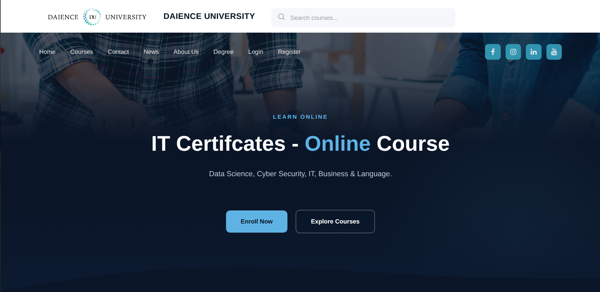
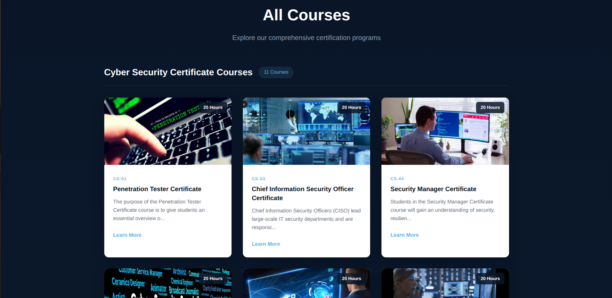
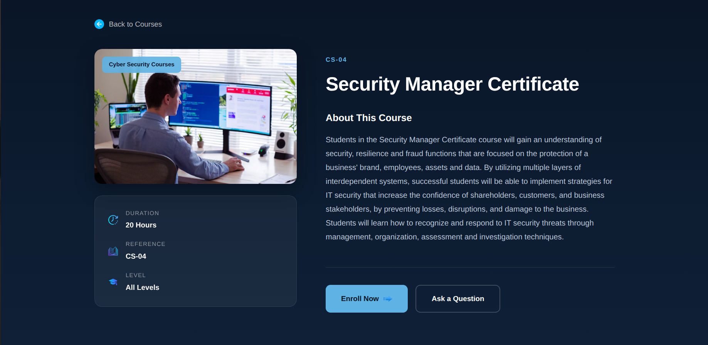
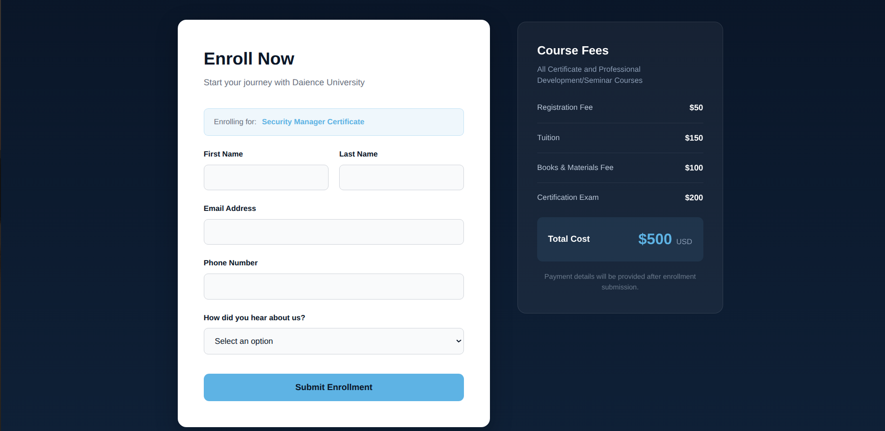
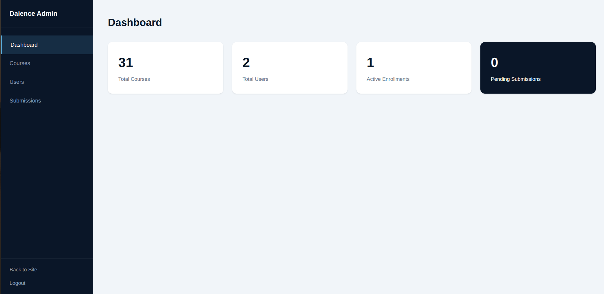
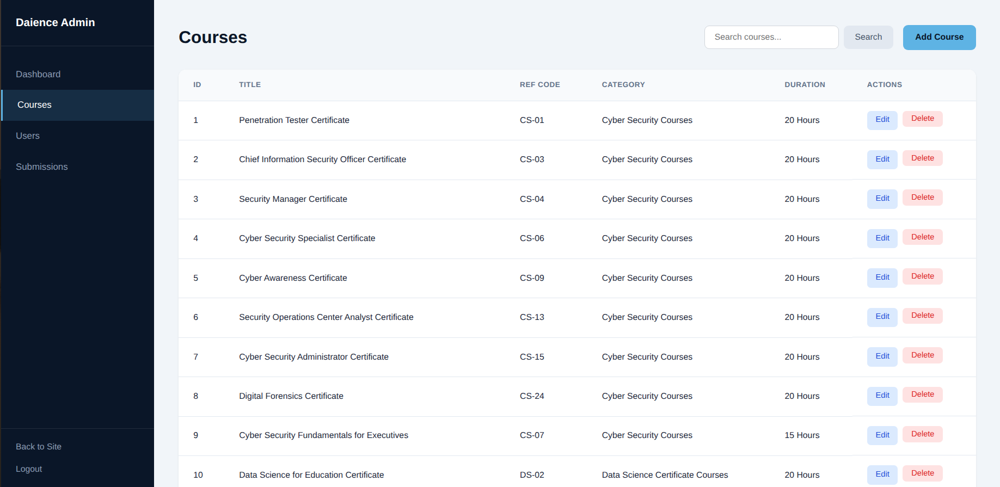

# 🎓 Daience University - Course Management System

A robust Full-Stack web application built with **PHP Laravel** and **MySQL**, designed to streamline university operations. This platform manages the lifecycle of academic courses, student enrollments, and departmental resources through a secure, role-based architecture.

---

## 📺 Project Demo & Media


> **Watch the Project Walkthrough:**
> [[click here!](https://drive.google.com/file/d/1vh3Xyc4b3n9aGgEGRkMsjUYE3fpsstYo/view?usp=drive_link)] 
> *(Or embed your video file below if uploaded to GitHub)*
> <video src="screenshots/demo_video.mp4" width="100%"></video>

---

## 🚀 Key Features

### 👨‍🎓 Student Features
* **Course Catalog:** Browse through available university courses with detailed descriptions and prerequisites.
* **Enrollment System:** Securely enroll in courses with real-time validation to prevent scheduling conflicts.
* **Academic Profile:** Personal dashboard to track enrolled courses and academic progress.







### 🏛️ Administrative Features
* **Course Management:** Full CRUD (Create, Read, Update, Delete) functionality for the university curriculum.
* **Resource Handling:** Manage departmental resources and instructor assignments dynamically.
* **RBAC (Role-Based Access Control):** Securely differentiated permissions for Students, Faculty, and Administrators to ensure data integrity.





### 🛠️ Technical Highlights
* **Relational Database:** Optimized MySQL schema handling complex relationships between students, courses, and departments.
* **Responsive UI:** Fully mobile-friendly design built for a seamless experience across all devices.
* **Authentication:** Secure user authentication and session management using Laravel's built-in Guard system.

---

## 💻 Tech Stack

| Layer | Technology |
| :--- | :--- |
| **Backend** | PHP 8.x (Laravel Framework) |
| **Frontend** | Blade Templates, JavaScript (Vanilla/Alpine), CSS3 |
| **Database** | MySQL |
| **Tooling** | Composer, Artisan CLI, Git |

---

## 🛠️ Installation & Setup

To run this project locally, follow these steps:

1. **Clone the repository:**
   ```bash
   git clone [https://github.com/Marah31/daience-university-courses-website.git](https://github.com/Marah31/daience-university-courses-website.git)
   cd daience-university-courses-website
   ```

2. **Install Dependencies:**
```bash
composer install
npm install && npm run dev
```


3. **Generate the application key:**

```bash
php artisan key:generate
```
4. **Database Migration:**

Run migrations to create the tables:

```bash
php artisan migrate
```
(Optional) If you have seeders for demo data:
```
bash
php artisan db:seed
```
5. **Start the Server:**

```bash
php artisan serve
```
Visit http://127.0.0.1:8000 in your browser.
